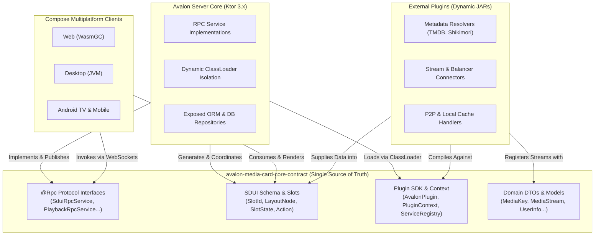

# 🌟 Avalon MediaCard Core Contract & Plugin SDK

<p align="center">
  <strong>English</strong> • <a href="README.ru.md">Русский</a>
</p>

<p align="center">
  <a href="https://jitpack.io/#ensodai/avalon-media-card-core-contract"></a>
  <a href="https://kotlinlang.org/"></a>
  <a href="LICENSE-MIT"></a>
</p>

> **The Single Source of Truth, Protocol Specification, and Extensible Plugin SDK for the Avalon MediaCard Ecosystem.**

`avalon-media-card-core-contract` is a multiplatform Kotlin library defining the strict API contracts, data transfer objects, Server-Driven UI (SDUI) schema, and RPC interfaces connecting all layers of the Avalon ecosystem.

---

## 🏛️ Ecosystem Architecture

The Core Contract sits at the center of the architecture, ensuring zero runtime schema divergence between the backend, client platforms, and dynamic third-party plugins:



---

## 🎯 What Does Core Contract Provide?

1. **Server-Driven UI (SDUI):** Declarative screen layouts, component slot definitions (`HeroBanner`, `Carousels`, `Banners`, `Exploration`, `Details`), reactive slot state streaming (`Loading`, `Content`, `Error`, `Empty`), and user action routing (`ActionNavigate`, `ActionPlay`, `ActionOpenUrl`).
2. **Strict Network Contracts (Kotlin-RPC):** Strongly typed, bidirectional RPC interfaces decorated with `@Rpc` for real-time WebSocket communication.
3. **Dynamic Plugin SDK:** Lifecycles (`AvalonPlugin`), dependency registries (`ServiceRegistry`), and isolated runtime contexts (`PluginContext`) for developing external JAR modules.
4. **Universal Cross-Platform Serialization:** Zero-divergence `kotlinx.serialization` (JSON / CBOR) contracts across JVM, Android, and WebAssembly targets.

---

## 🧩 Server-Driven UI (SDUI) Specification

Avalon screens are constructed dynamically at runtime through modular slots:

### 1. Slots & Layout Nodes
* **`SlotId`:** Identifies screen regions (e.g. `SlotId.HeroBanner`, `SlotId.Carousels`, `SlotId.MediaGrid`).
* **`LayoutNode`:** Ordered layout elements declaring which `SlotId` to render and its unique `nodeId`.

### 2. Slot Lifecycle & States
Every slot emits its state reactively via Kotlin Coroutines `Flow<SlotUpdate>`:
* **`SlotState.Loading`:** Renders shimmering skeleton placeholders matching the slot dimensions.
* **`SlotState.Content(data)`:** Delivers structured payload (e.g., `SlotData.Carousel`, `SlotData.Hero`, `SlotData.EpisodeGrid`).
* **`SlotState.Error(message)`:** Renders graceful fallback UI with retry triggers.
* **`SlotState.Empty`:** Hides the slot container completely from the UI tree.

### 3. Action Pipeline
User interactions (clicks, remote selections) are decoupled into polymorphic actions:
* `ActionNavigate(screen)` — Direct navigation to target `Screen.*`.
* `ActionPlay(mediaKey, episodeIndex)` — Dispatches playback to the universal player matrix.
* `ActionOpenUrl(url)` — Triggers an external browser or deep link.

---

## 📦 Integrating Core Contract into a Plugin

### 1. Repository Configuration (`settings.gradle.kts`)

```kotlin
dependencyResolutionManagement {
    repositories {
        mavenCentral()
        maven { url = uri("https://jitpack.io") }
    }
}
```

> 💡 **Local Development Tip:** For local side-by-side development, connect the contract project directly via Gradle composite build:
> ```kotlin
> if (file("../avalon-media-card-core-contract").exists()) {
>     includeBuild("../avalon-media-card-core-contract")
> }
> ```

---

### 2. Adding the Dependency (`build.gradle.kts`)

#### Option A: Via Version Catalog (`gradle/libs.versions.toml`) — Recommended

```toml
[versions]
avalon-core-contract = "v1.0.2"

[libraries]
avalon-core-contract = { module = "com.github.ensodai:avalon-media-card-core-contract", version.ref = "avalon-core-contract" }
```

In your plugin's `build.gradle.kts`:
```kotlin
plugins {
    kotlin("jvm")
    kotlin("plugin.serialization")
}

dependencies {
    implementation(libs.avalon.core.contract)
    implementation("org.jetbrains.kotlinx:kotlinx-serialization-json:1.8.0")
}
```

#### Option B: Direct JitPack Dependency

```kotlin
dependencies {
    implementation("com.github.ensodai:avalon-media-card-core-contract:v1.0.2")
    implementation("org.jetbrains.kotlinx:kotlinx-serialization-json:1.8.0")
}
```

---

## 🛠️ Step-by-Step Plugin Implementation

### 1. Implement `AvalonPlugin`

```kotlin
package com.example.myplugin

import kotlinx.coroutines.flow.flow
import org.ensodai.avalonmediacard.contract.model.SidebarItem
import org.ensodai.avalonmediacard.contract.plugins.AvalonPlugin
import org.ensodai.avalonmediacard.contract.plugins.PluginContext
import org.ensodai.avalonmediacard.contract.slot.*
import org.ensodai.avalonmediacard.contract.ui.navigation.Screen

class MyCustomPlugin : AvalonPlugin {

    override val id: String = "org.example.myplugin"
    override val name: String = "My Custom Plugin"
    override val version: String = "1.0.0"
    override val author: String = "Developer"

    override fun onInitialize(context: PluginContext) {
        // 1. Declare slot layout on the Dashboard screen
        context.slots.declare<Screen.Dashboard>(
            slots = listOf(SlotId.Carousels),
            manifestLayout = { userId ->
                listOf(LayoutNode(nodeId = "my_custom_carousel", slotId = SlotId.Carousels))
            }
        )

        // 2. Supply dynamic content for the declared slot
        context.screens.onScreen<Screen.Dashboard> { screen, userId ->
            listOf(
                SlotUpdate(
                    slotId = SlotId.Carousels,
                    nodeId = "my_custom_carousel",
                    state = SlotState.Content(
                        SlotData.Carousel(
                            title = "Featured from Plugin",
                            items = listOf(
                                MediaCardItem(
                                    id = "item_1",
                                    title = "Example Movie",
                                    posterUrl = "https://example.com/poster.jpg",
                                    action = ActionNavigate(Screen.MovieDetails(id = "item_1"))
                                )
                            )
                        )
                    )
                )
            )
        }

        // 3. Register custom stream providers
        context.streams.registerProvider("example_stream_source") { mediaKey, season, episode, user ->
            listOf(/* StreamSource objects */)
        }

        // 4. Inject items into the client Sidebar navigation
        context.sidebars.provide { userId ->
            flow {
                emit(
                    listOf(
                        SidebarItem(
                            itemId = "my_custom_tab",
                            title = "My Section",
                            route = "my_custom_tab",
                            order = 10
                        )
                    )
                )
            }
        }
    }
}
```

---

### 2. Service Provider Interface (SPI) Registration

To allow the Avalon server to automatically discover your plugin at startup via `ServiceLoader`, create the following file in your plugin resources:

`src/main/resources/META-INF/services/org.ensodai.avalonmediacard.contract.plugins.AvalonPlugin`

With your class's fully qualified name:
```text
com.example.myplugin.MyCustomPlugin
```

---

### 3. Packaging and Deployment

Configure JAR packaging in `build.gradle.kts`:

```kotlin
tasks.named<Jar>("jar") {
    archiveFileName.set("my-custom-plugin.jar")
}
```

Build the plugin bundle:
```bash
./gradlew build
```

Copy the generated `build/libs/my-custom-plugin.jar` into the `plugins/` directory of your running Avalon MediaCard server. The server will detect and hot-reload the plugin automatically!

---

## 📦 Core Contract Package Overview

| Package | Key Responsibilities |
|---|---|
| `org.ensodai.avalonmediacard.contract.plugins` | `AvalonPlugin`, `PluginContext`, `ServiceRegistry`, `PluginSettings`, `PluginIntegrationManager` |
| `org.ensodai.avalonmediacard.contract.slot` | SDUI models: `SlotId`, `SlotData`, `SlotState`, `SlotUpdate`, `LayoutNode`, `Action*` |
| `org.ensodai.avalonmediacard.contract.rpc` | Kotlin-RPC service contracts (`SduiRpcService`, `PlaybackRpcService`, `AdminRpcService`...) |
| `org.ensodai.avalonmediacard.contract.model` | Domain DTOs: `MediaStream`, `PlaybackStream`, `MediaKey`, `SidebarItem`, `UserInfo` |
| `org.ensodai.avalonmediacard.contract.ui.navigation` | Navigation graph: `Screen.Dashboard`, `Screen.Movies`, `Screen.TvShows`, `Screen.Admin` |
| `org.ensodai.avalonmediacard.contract.i18n` | Internationalization contracts: `PluginI18n` |

---

## 📄 License

This contract library is licensed under the permissive [MIT License](LICENSE-MIT).