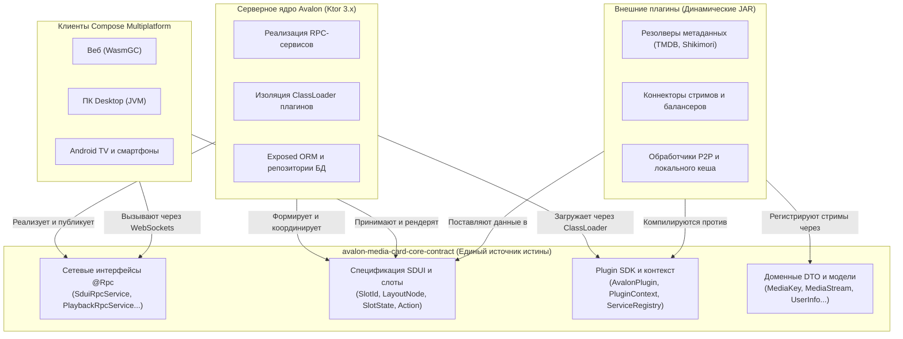

# 🌟 Avalon MediaCard Core Contract & Plugin SDK

<p align="center">
  <a href="README.md">English</a> • <strong>Русский</strong>
</p>

<p align="center">
  <a href="https://jitpack.io/#ensodai/avalon-media-card-core-contract"></a>
  <a href="https://kotlinlang.org/"></a>
  <a href="LICENSE-MIT"></a>
</p>

> **Единый источник истины (Single Source of Truth), спецификация протокола и SDK плагинов экосистемы Avalon MediaCard.**

`avalon-media-card-core-contract` — это мультиплатформенная библиотека на Kotlin, определяющая строгие контракты API, объекты передачи данных (DTO), схемы Server-Driven UI (SDUI) и RPC-интерфейсы, объединяющие все уровни экосистемы Avalon.

---

## 🏛️ Архитектура экосистемы

Контракт ядра находится в самом центре системы, гарантируя 100% согласованность схем между бэкендом, клиентскими платформами и динамическими сторонними плагинами:



---

## 🎯 Что предоставляет Core Contract?

1. **Server-Driven UI (SDUI):** Декларативное описание разметки экранов, узлы слотов (`HeroBanner`, `Carousels`, `Banners`, `Exploration`, `Details`), реактивная доставка состояний слотов (`Loading`, `Content`, `Error`, `Empty`) и маршрутизация действий пользователя (`ActionNavigate`, `ActionPlay`, `ActionOpenUrl`).
2. **Сетевые контракты (Kotlin-RPC):** Строго типизированные интерфейсы удаленного вызова процедур, помеченные аннотацией `@Rpc`, для взаимодействия через WebSockets.
3. **SDK динамических плагинов:** Жизненный цикл (`AvalonPlugin`), реестр сервисов (`ServiceRegistry`) и изолированные контексты (`PluginContext`) для разработки расширений в виде независимых JAR.
4. **Кроссплатформенная сериализация:** Контракты `kotlinx.serialization` (JSON / CBOR) работают единообразно на JVM, Android и WebAssembly.

---

## 🧩 Спецификация Server-Driven UI (SDUI)

Интерфейс экранов Avalon формируется сервером динамически в виде модульных слотов:

### 1. Слоты и узлы разметки (Layout Nodes)
* **`SlotId`:** Идентификаторы областей экрана (например, `SlotId.HeroBanner`, `SlotId.Carousels`, `SlotId.MediaGrid`).
* **`LayoutNode`:** Упорядоченные элементы разметки, указывающие какой `SlotId` отображать и его уникальный `nodeId`.

### 2. Жизненный цикл и состояния слота
Каждый слот поставляет свое состояние через Kotlin Coroutines `Flow<SlotUpdate>`:
* **`SlotState.Loading`:** Отображает скелетон-плейсхолдер по размеру контента.
* **`SlotState.Content(data)`:** Поставляет полезную нагрузку (`SlotData.Carousel`, `SlotData.Hero`, `SlotData.EpisodeGrid` и др.).
* **`SlotState.Error(message)`:** Отрисовывает состояние ошибки с кнопкой повтора.
* **`SlotState.Empty`:** Полностью скрывает область слота из дерева интерфейса.

### 3. Обработка действий (Action Pipeline)
Взаимодействие пользователя отделено в полиморфные действия:
* `ActionNavigate(screen)` — Навигация на целевой экран `Screen.*`.
* `ActionPlay(mediaKey, episodeIndex)` — Передача медиапотока в универсальную матрицу плееров.
* `ActionOpenUrl(url)` — Открытие внешней ссылки в браузере.

---

## 📦 Подключение контракта к плагину

### 1. Настройка репозиториев (`settings.gradle.kts`)

```kotlin
dependencyResolutionManagement {
    repositories {
        mavenCentral()
        maven { url = uri("https://jitpack.io") }
    }
}
```

> 💡 **Совет для локальной разработки:** При разработке на одном компьютере подключите проект контракта напрямую через композитную сборку:
> ```kotlin
> if (file("../avalon-media-card-core-contract").exists()) {
>     includeBuild("../avalon-media-card-core-contract")
> }
> ```

---

### 2. Добавление зависимости (`build.gradle.kts`)

#### Вариант A: Через Version Catalog (`gradle/libs.versions.toml`) — Рекомендуется

```toml
[versions]
avalon-core-contract = "v1.0.2"

[libraries]
avalon-core-contract = { module = "com.github.ensodai:avalon-media-card-core-contract", version.ref = "avalon-core-contract" }
```

В `build.gradle.kts` плагина:
```kotlin
plugins {
    kotlin("jvm")
    kotlin("plugin.serialization")
}

dependencies {
    implementation(libs.avalon.core.contract)
    implementation("org.jetbrains.kotlinx:kotlinx-serialization-json:1.8.0")
}
```

#### Вариант B: Прямая зависимость через JitPack

```kotlin
dependencies {
    implementation("com.github.ensodai:avalon-media-card-core-contract:v1.0.2")
    implementation("org.jetbrains.kotlinx:kotlinx-serialization-json:1.8.0")
}
```

---

## 🛠️ Пошаговое создание плагина

### 1. Реализация интерфейса `AvalonPlugin`

```kotlin
package com.example.myplugin

import kotlinx.coroutines.flow.flow
import org.ensodai.avalonmediacard.contract.model.SidebarItem
import org.ensodai.avalonmediacard.contract.plugins.AvalonPlugin
import org.ensodai.avalonmediacard.contract.plugins.PluginContext
import org.ensodai.avalonmediacard.contract.slot.*
import org.ensodai.avalonmediacard.contract.ui.navigation.Screen

class MyCustomPlugin : AvalonPlugin {

    override val id: String = "org.example.myplugin"
    override val name: String = "My Custom Plugin"
    override val version: String = "1.0.0"
    override val author: String = "Developer"

    override fun onInitialize(context: PluginContext) {
        // 1. Декларация разметки слотов на экране Главная (Dashboard)
        context.slots.declare<Screen.Dashboard>(
            slots = listOf(SlotId.Carousels),
            manifestLayout = { userId ->
                listOf(LayoutNode(nodeId = "my_custom_carousel", slotId = SlotId.Carousels))
            }
        )

        // 2. Поставка динамических данных в объявленный слот
        context.screens.onScreen<Screen.Dashboard> { screen, userId ->
            listOf(
                SlotUpdate(
                    slotId = SlotId.Carousels,
                    nodeId = "my_custom_carousel",
                    state = SlotState.Content(
                        SlotData.Carousel(
                            title = "Подборка от плагина",
                            items = listOf(
                                MediaCardItem(
                                    id = "item_1",
                                    title = "Пример фильма",
                                    posterUrl = "https://example.com/poster.jpg",
                                    action = ActionNavigate(Screen.MovieDetails(id = "item_1"))
                                )
                            )
                        )
                    )
                )
            )
        }

        // 3. Регистрация собственного провайдера стримов
        context.streams.registerProvider("example_stream_source") { mediaKey, season, episode, user ->
            listOf(/* Объекты StreamSource */)
        }

        // 4. Добавление раздела в боковое меню (Sidebar) клиента
        context.sidebars.provide { userId ->
            flow {
                emit(
                    listOf(
                        SidebarItem(
                            itemId = "my_custom_tab",
                            title = "Мой раздел",
                            route = "my_custom_tab",
                            order = 10
                        )
                    )
                )
            }
        }
    }
}
```

---

### 2. Регистрация через Service Provider Interface (SPI)

Чтобы сервер Avalon автоматически обнаружил ваш JAR-плагин при запуске через `ServiceLoader`, создайте файл в ресурсах плагина:

`src/main/resources/META-INF/services/org.ensodai.avalonmediacard.contract.plugins.AvalonPlugin`

С полным каноническим именем класса:
```text
com.example.myplugin.MyCustomPlugin
```

---

### 3. Сборка и установка

Настройте сборку JAR в `build.gradle.kts`:

```kotlin
tasks.named<Jar>("jar") {
    archiveFileName.set("my-custom-plugin.jar")
}
```

Соберите плагин:
```bash
./gradlew build
```

Поместите полученный `build/libs/my-custom-plugin.jar` в каталог `plugins/` запущенного сервера Avalon MediaCard. Сервер обнаружит и загрузит плагин на лету!

---

## 📦 Обзор пакетов контракта

| Пакет | Ключевые компоненты |
|---|---|
| `org.ensodai.avalonmediacard.contract.plugins` | `AvalonPlugin`, `PluginContext`, `ServiceRegistry`, `PluginSettings`, `PluginIntegrationManager` |
| `org.ensodai.avalonmediacard.contract.slot` | Модели SDUI: `SlotId`, `SlotData`, `SlotState`, `SlotUpdate`, `LayoutNode`, `Action*` |
| `org.ensodai.avalonmediacard.contract.rpc` | Контракты сервисов Kotlin-RPC (`SduiRpcService`, `PlaybackRpcService`, `AdminRpcService`...) |
| `org.ensodai.avalonmediacard.contract.model` | Доменные DTO: `MediaStream`, `PlaybackStream`, `MediaKey`, `SidebarItem`, `UserInfo` |
| `org.ensodai.avalonmediacard.contract.ui.navigation` | Граф навигации: `Screen.Dashboard`, `Screen.Movies`, `Screen.TvShows`, `Screen.Admin` |
| `org.ensodai.avalonmediacard.contract.i18n` | Интерфейсы локализации: `PluginI18n` |

---

## 📄 Лицензия

Библиотека контракта распространяется под свободной лицензией [MIT License](LICENSE-MIT).
